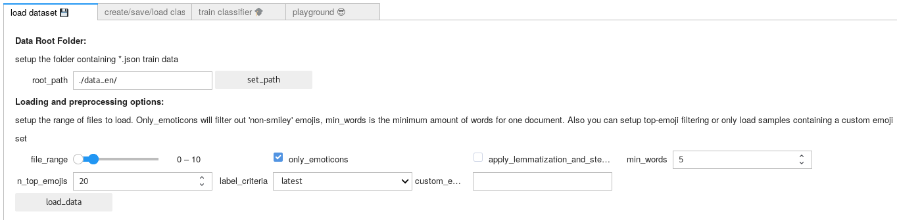
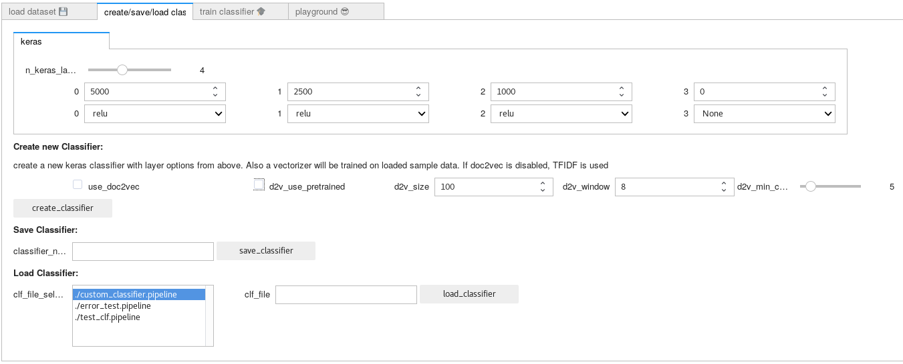
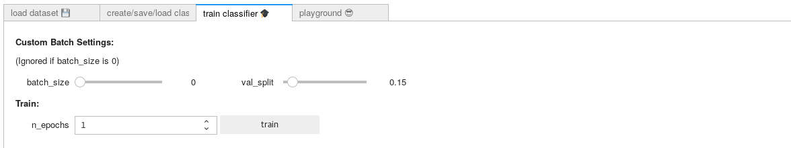

# Advanced Approach

----

## Folder Overview

| File/Folder                                                  | short_description                                            |
| ------------------------------------------------------------ | ------------------------------------------------------------ |
| [twitter_learning.py](twitter_learning.py)                   | module containing the main classes for the learning process  |
| [Learner.ipynb](Learner.ipynb)                               | notebook containing a user interface to control the learn process |
| [Evaluation_sentiment_dataset.ipynb](Evaluation_sentiment_dataset.ipynb) | notebook creating an evaluation on the sentiment dataset     |
| [data_en](data_en)                                           | place the data to train on here!                             |

----

## twitter_learning.py

We wanted the possibility to load and save classifier and also to continue the train process of a loaded classifier on other datasets. Since this functionality doesn't fit well in a single linear processed notebook, we wrote this module containing three classes for managing train data, classifier and train process:

### sample_data_manager

class for preprocessing twitter data provided as json files. Creates samples with sentiment labels and provides train and validation samples

### pipeline_manager

creates, saves or loads a sklean-pipeline with vectorizer and keras classifier.  When a new classifier is created, the vectorizer is fit by all samples that a given [sample_data_manager](#sample_data_manager) has stored at that moment.

### trainer

expects a [pipeline_manager](#pipeline_manager) and a [sample_data_manager](#sample_data_manager). It controls the train process and feeds the pipeline with data from the [sample_data_manager](#sample_data_manager). Since we want the possibility to continue training on loaded classifiers, this class modifies the pipeline during runtime to prevent a reset of the vectorizers while fitting new data.

----

## Learner.ipynb

In short: the user interface for methods provided in [twitter_learning.py](#twitter_learning.py) This file provides all controls for the train process and feeds the classifier with data. To use it just run all cells and jump to the user interface Part. In order to train on a dataset, just use it in the following way:

### load datasets

* setup the root folder for the json files containing our twitter samples
* then you can set the range of files that will be loaded. Also you can setup more preprocessing steps, like top-emoji usage filtering or only load samples containing a specific set of emojis (given as string)

### create/save/load classifier

* create a new keras pipeline including a vectorizer. you can setup the number of neurons and the activation function per layer (the last layer will be automatically adjusted to fit the label-dimension). if doc2vec is deactivated, tfidf is used. In the image above is the configuration we used for our final classifier. 
* you can also save a trained classifier and load it later again by a .pipeline configuration file (either by selecting them in the file selector box or by give the full path to the `clf_file` box)

### train classifier

* if sample data and classifier are loaded, the classifier can be trained here

### Test single predictions

* in the playground tab you can predict single sentences and get the nearest emoji in sentiment space of a given emoji set. Also you can plot the predictions of samples with given labels (as emoji) of the validation set of the currently loaded twitter data 

----

## Evaluation_sentiment_dataset.ipynb

this is just a notebook to perform and plot the predictions on our hand labeled validation set