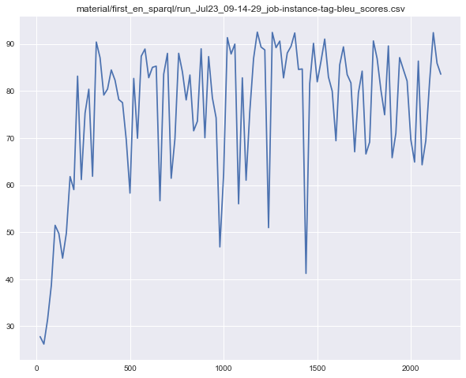
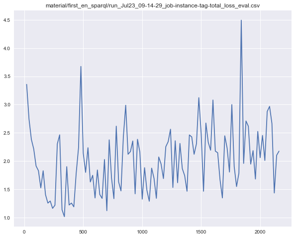
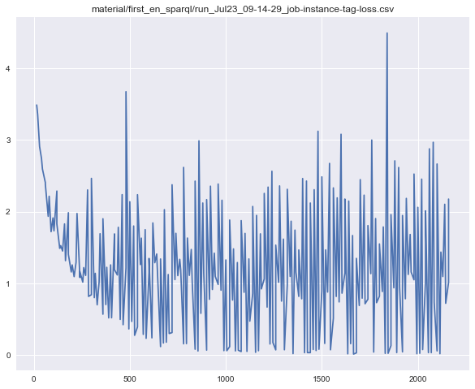
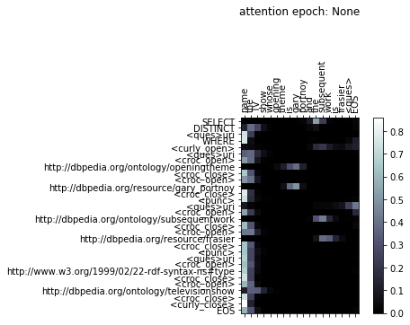
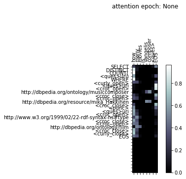

# NL 2 SPARQL
by Nico Lutz (2954361) SS 18 Uni Bonn NLP Lab

An NMT approach to translate english sentences to sparql queries...

## Preprocess/Dataset
The [LCQuad](https://github.com/AskNowQA/LC-QuAD) dataset was used. It contains 5000 questions with corresponding Sparql queries and its results from [dbpedia](https://wiki.dbpedia.org/). (Be aware as of Juli 2018 the dataset is split into a train/test split which is not used in this Version. Also the dataset uses DBpedia version 04-2016, which might cause many SPARQL queries to not retrieve any answer. To solve this host this version locally. See the repository for more information.)

Here I simply read in the data, substitute special characters and add EOS, SOS and PAD tokens to the dataset. I make a train/test split. 

## Lang class

Then the data is read into a lang class. Here the words are counted, indexed and saved into a dictionary. This serves as an input for the embedding layer. This is also known as a vocabulary.

## Architecture
I use a standard Seq2Seq approach where the Encoder consists of an embedding layer and bidirectional LSTMs. The Decoder takes the encoder output and computes with the help of an attention mechanism an output. For training a randomly induces teacher forcing is used, meaning that in 50% of the cases the decoder takes the ground truth values as the next input and else its own outputs.

Evaluation is done on evaluation set every 25 epochs.

## Results

## Comparison to other approaches


## Outlook
From the beginning on the idea was to pretrain a model as described in the above fashion and use the sparql outputs to set "real" queries to the dbpedia server the results could be compared to the ground truth results. A score would have been calculated and used in a reinforced manner to update the network. As described above I wasn't aware until recently that the dataset is based on dbpedia version 2016 and addition efforts would have been necessery to make the requests ( run dbpedia locally ). 

In addition shared or pretrained embeddings could improve entity mappings.
Also probabilistic inspired beam search algorithm could improve performance.

## Results
Bleu Accuracy on Eval set



Loss on Eval set



Loss during training



Attention after training on evaluation sentence:

* input-sentence: ```name the TV show whose opening theme is gary portnoy and the subsequent work is frasier <ques> EOS```

* target-sentence: ``` SELECT DISTINCT <ques>uri WHERE <curly_open> <ques>uri <croc_open> http://dbpedia.org/ontology/openingtheme <croc_close> <croc_open> http://dbpedia.org/resource/gary_portnoy <croc_close> <punc> <ques>uri <croc_open> http://dbpedia.org/ontology/subsequentwork <croc_close> <croc_open> http://dbpedia.org/resource/frasier <croc_close> <punc> <ques>uri <croc_open> http://www.w3.org/1999/02/22-rdf-syntax-ns#type <croc_close> <croc_open> http://dbpedia.org/ontology/televisionshow <croc_close> <curly_close> EOS```

* output-sentence ```SELECT DISTINCT <ques>uri WHERE <curly_open> <ques>uri <croc_open> http://dbpedia.org/ontology/openingtheme <croc_close> <croc_open> http://dbpedia.org/resource/gary_portnoy <croc_close> <punc> <ques>uri <croc_open> http://dbpedia.org/ontology/subsequentwork <croc_close> <croc_open> http://dbpedia.org/resource/frasier <croc_close> <punc> <ques>uri <croc_open> http://www.w3.org/1999/02/22-rdf-syntax-ns#type <croc_close> <croc_open> http://dbpedia.org/ontology/televisionshow <croc_close> <curly_close> EOS```




A random sentence (with words in the vocab):

* input-sentence: ```how many movies is vangelis composer <ques> EOS```

* output-sentence ```SELECT DISTINCT COUNT( <ques>uri) WHERE <curly_open> <ques>uri <croc_open> http://dbpedia.org/ontology/musiccomposer <croc_close> <croc_open> http://dbpedia.org/resource/mika_Hakkinen <croc_close> <punc> <ques>uri <croc_open> http://www.w3.org/1999/02/22-rdf-syntax-ns#type <croc_close> <croc_open> http://dbpedia.org/ontology/film <croc_close> <curly_close> EOS```

